<!-- 

Liste des journaux possibles :

1. Methods in Ecology and Evolution. IF: 7.78. Research Article: Words 7000~8000

2. Ecology. IF: 5.499. Research Article or Statistical Reports. Words ~8000 (20 pages max)

3. Journal of Ecology. IF: 6.26. Resear articles. Words 8000

 -->

# Introduction

Community ecology aims at explaining and predicting the processes that drive species diversity and their variability in space and time. Understanding the processes that drive species distribution across the globe and the associated spatio-temporal dynamics is particularly critical in the context of global climate change and the sixth mass extinction [@ipbes_2019]. To tackle these challenges, modern ecology must be able to describe, explain, and predict community change [@Tredennick_2021], with an emphasis on biodiversity predictions, especially to be able to implement efficient management or restoration measures in a rapidly changing world [@Brudvig_2022; @Dietze_2018; @Houlahan_2017]. Joint distribution models (jSDMs) are particularly well-suited tools to address these challenges, whether to enable explanation of the processes behind observed community [@Ovaskainen_2017a], or by predicting the future fate of community [@Norberg_2019] in a way that is more easily understood compared to machine learning models.

The jSDMs are multivariate extensions of the more traditional stastic Species Distribution Models (SDMs). Thanks to their multivariate distributions, jSDMs estimate co-occurrence patterns between species allowing for environmental factors and biotic interactions not included by the researcher in the model [@Ovaskainen_2017a]. The hope of better accounting for biotic interactions has been one of the main promises that have attracted the interest of the scientific community to these models [@Ovaskainen_2017b; @Warton_2015]. Better understanding the role of biotic interactions is a crucial interest for ecologists, but also for models by improving their predictive power [@Giannini_2013; @Staniczenko_2017], but also to identify the relative role of ecological processes [@Godsoe_2017]. While the networks inferred from jSDM co-occurrence are not limited to biotic interactions (see below regarding the interpretation of these networks), one of the prerequisites for improving the predictions made by jSDMs is to take into account all the actors in the network [@Levine_2017]. Many studies focus on certain taxonomic groups or clades [@Hakkila_2018; @Pollock_2014], but forgetting some actors can affect the networks inferred from jSDMs [@Momal_2021] and thus limit the power of this approach.

SDMs have evolved over time to take into account phylogenetic relationships between species [@Ives_2011] and links between functional traits and the environment [@Pollock_2012].  The inclusion of this additional information allows the explanatory and predictive power of the SDM [@Morales-Castilla_2017; @Vesk_2021]. Thanks to their framework close to traditional SDMs, jSDMs have been easily extended to take into account these additional information sources [@Niku_2019; @Ovaskainen_2017a]. The second interest of the jSDM structure is the study of species interactions through species co-occurrence. [@Chiquet_2021; @Ovaskainen_2017a; @Ovaskainen_2017b; @Warton_2015]. However, the study of these co-occurrences inferred from presence/absence data does not provide access to species interactions [@Blanchet_2020; @Dormann_2018]. Abundance data allow us to infer interaction networks [@Momal_2020], but the signal on which this inference is based is blurred by environmental variables not taken into account in the model [@Poggiato_2021], so such networks must be interpreted with caution. 

However, jSDM by allowing the use of many different data sources such as occurrence or abundance, functional traits, phylogenetic relationships remain promising methods to answer many ecological questions, especially with the emergence of large datasets on species (e.g., OBIS, GBIF), functional traits (e.g., longevity, trophic regime; see e.g., Fishbase) or phylogenetic distances (e.g., NCBI, BOLD) are still interesting methods for many applications in ecology. Nowadays, there is a large literature on the comparison of the performance of jSDM applied to occurrence data [@Norberg_2019; @Wilkinson_2019] or on the study of the performance of SDM applied to abundance data [@Waldock_2022]. 

Nevertheless, many questions and challenges remain as to the best way to use jSDM in ecology: with the possibility of including a lot of additional information about species, what is the gain in explanatory and predictive power for a target species assemblage of (1) including phylogenetic and traits information, or (2) including abundance or occurrence data of non-target species? We hypothesize here that the inclusion of non-target species improves explanatory and predictive power compared to a baseline model, but this improvement is smaller compared to the inclusion of phylogenetic and functional trait information.

Here, we used the jSDM framework HMSC [@Tikhonov_2019b] applied to a regional monitoring species-rich dataset of coastal benthic assemblages to systematically test out for the effects of including species-specific information and/or abundance or occurrence of non-target species on model explanatory and predictive powers, and their interpretability. We choose to compare the different possible architectures of models to predict an assembly of interest: the polychaetes. Polychaetes are a group of species of ecological interest because of the wide variety of ecological niches and ecosystem functions they fulfill [REF].

<!-- 
Community ecology aims at explaining and predicting the processes that drive species diversity and their variability in space and time. Understanding the processes that drive species distribution across the globe and the associated spatio-temporal dynamics is particularly critical in the context of global climate change and the sixth mass extinction [@ipbes_2019]. To face these challenges, researchers can rely on the triptych of modern numerical ecology: exploring ecological data, inferring processus and predicting changes with numerical tools [@Tredennick_2021]. Species Distribution Models (SDM) fit perfectly into this tryptic and that is why they have become so popular among ecologists in the last twenty years [@Araujo_2019 ; @Robinson_2017]. By allowing to explain and predict the occurrence and abundance of species, these models have led to many advances in the disciplinary fields of management, conservation and restoration [REF].

SDM have been extended to all modeling frameworks: maximum likelihood, Bayesian inference, machine learning [@Norberg_2019]. The profusion of available models also implies choices regarding community modeling strategies. There are two different philosophies: the first consists of modeling species independently and then stacking the models, the second method consists of modeling all species at once in a single model [@Ferrier_2006]. Unlike the first method, the predict & assemble together strategy allows to take into account the effect of the environment on the distribution of the species, but also the effect of each species on the distribution of the others. This property is important, since interactions between species through competition or facilitation can modify the range of species [@Araujo_2007 ; @Bateman_2012, Thuillier 2015].

With recent mathematical and methodological developments, Joint Species Distribution Models (jSDM) have allowed an efficient application of the predict & assemble together strategy. jSDMs extend the more classical SDMs such as GLM by using multivariate distributions [@Warton_2015]. Simultaneous modeling of all species allows the model to share a common residual structure for all species and allows the estimation of a residual correlation matrix not explained by the environment [@Warton_2015]. Thus, jSDM proposes to model the realized niche of each species by taking into account the abiotic and biotic account in which all species in the community evolve.

The advantages of jSDM are in theory numerous: given their proximity to classical GLM, they are easily extendable to include functional traits, phylogenetic relationships between species, as well as the spatio-temporal context of the communities studied [@Ovaskainen_2017a ; @Tikhonov_2019a ; @Warton_2015]. These extensions of jSDM allow the improvement of the goodness of fit of the model for rare species. jSDMs assume that species that are phylogenetically close and/or share the same functional traits will occupy similar ecological niches [@Niku_2019 ; @Ovaskainen_2017a ; @Warton_2015]. Moreover, the hierarchical nature of these models allows the sharing of information between species, so that rare species are able to borrow information from more common species, thus improving their goodness of fit. Furthermore, the use of latent variables to estimate the residual correlation allows to take into account the effect of variables not taken into account in the model, thus improving globally the goodness of fit of the model. 

jSDM seemed at its beginning to open new doors for ecologists, it was promising at first to derive biotic interactions from simple presence/absence data [@Ovaskainen_2017b ; @Warton_2015]. But actually, co-occurrence is not evidence for interactions [@Blanchet_2020] and interpreting residual correlations between species is more challenging than promised by the jSDM [@Poggiato_2021]. However, some claims about these models have been demonstrated to be accurate, by accounting for co-occurrence patterns relative to classical SDM, the predictive/explanatory performance of jSDM can be higher than classical approaches [@Norberg_2019].

Thus, jSDM by allowing the use of many different data sources such as occurrence or abundance, functional traits, phylogenetic relationships remain promising methods to answer many ecological questions, especially with the emergence of large datasets on species (e.g., OBIS, GBIF), functional traits (e.g., longevity, trophic regime; see e.g., Fishbase) or phylogenetic distances (e.g., NCBI, BOLD) are still interesting methods for many applications in ecology. Nevertheless, many questions and challenges remain as to the best way to use jSDM in ecology: with the possibility of including a lot of additional information about species, what is the gain in explanatory and predictive power for a target species assemblage of (1) including phylogenetic and traits information, or (2) including abundance or occurrence data of non-target species? We hypothesize here that the inclusion of non-target species improves explanatory and predictive power compared to a baseline model, but this improvement is smaller compared to the inclusion of phylogenetic and functional trait information.

Here, we used the jSDM framework HMSC [@Tikhonov_2019b] applied to a regional monitoring species-rich dataset of coastal benthic assemblages to systematically test out for the effects of including species-specific information and/or abundance or occurrence of non-target species on model explanatory and predictive powers, and their interpretability. We choose to compare the different possible architectures of models to predict an assembly of interest: the polychaetes. Polychaetes are a group of species of ecological interest because of the wide variety of ecological niches and ecosystem functions they fulfill [REF]. 
-->

# Materiel and Methods

We used the HMSC framework applied to some of the data acquired by the REBENT monitoring program (website). In the following subsections, we describe (1) the HMSC framework, (2) the data used in this study, (3) the splitting of this dataset into training and testing datasets, (4) the different models we have used and their rationale, (4) how model performance was assessed.

## Hierarchical Modeling of Species (HMSC)

"*HMSC* is a mutilvariate hierarchical generalized linear mixed model adjusted with Bayesian inference rooted in assembly theory" [@Ovaskainen_2020]. A *HMSC* model is composed of two parts: one taking into account fixed effects and the other taking into account random effects. The fix part models the realized niche (i.e. the set of environmental conditions that is biotically suitable and accessible) of each species (B matrix), where each dimension of the niche is a covariate included in the model [@Ovaskainen_2020]. Without any traits, the *HMSC* framework assumes that all species share the same expected niche value for each covariate, however, the width of each niche is assumed to be species-independent. Including trait data enables us to estimate species-specific expected niche value as well as trait-environment relationships [@Ovaskainen_2017a ; @Ovaskainen_2020]. In addition, it is now well established that closely related species tend to share similar trait values. This phylogenetic information can readily be included in the model. As a result, *HMSC* can capture the residual information not included in the trait data, allowing a better estimation of the ecological niches of the species included in the model. [@Ovaskainen_2020].

Since *HMSC* can include a random part, it can constrain the estimated residuals with random effects. These random effects are estimated using latent variables: for each random effect, two matrices of latent variables are estimated [Ovaskainen_2017a ; @Tikhonov_2019b ; @Ovaskainen_2020]. One of them, thereby called *site loadings* ($H$ matrix) contains the values of missing covariates not included in the model at the level of this random effect [@Ovaskainen_2017a ; @Ovaskainen_2020]. The other matrix, thereafter called *species loadings* ($\Lambda$ matrix) correspond to the response of the species to each of these missing predictors at the level of this random effect [@Ovaskainen_2017a ; @Ovaskainen_2020]. These missing covariate can be missing environmental features, but, if the model models well the environmental niche of each species, the remaining information are more likely to contain some biotic interaction signals [@Ovaskainen_2017a ; @Ovaskainen_2017b ; @Ovaskainen_2020].

Since *HMSC* can include a random part, it can constrain the estimated residuals with random effects. These random effects are estimated using latent variables: for each random effect, two matrices of latent variables are estimated [@Ovaskainen_2017a ; @Tikhonov_2019b ; @Ovaskainen_2020]. One of them, thereafter called site loadings ($H$ matrix) contains the values of missing covariates not included in the model at the level of this random effect [@Ovaskainen_2017a ; @Ovaskainen_2020]. The other matrix, thereafter called species loadings ($\Lambda$ matrix) correspond to the response of the species to each of these missing predictors at the level of this random effect [@Ovaskainen_2017a ; @Ovaskainen_2020]. These missing covariate can either represent the effect of some missing environmental features. Alternatively, if the model accurately captures the environmental niche of each species, then the remaining information may contain some of biotic interaction signals [@Ovaskainen_2017a ; @Ovaskainen_2017b ; @Ovaskainen_2020].

## Dataset

### Biotic dataset

Faunistic data were provided by the REBENT monitoring program. REBENT is a station-based monitoring network created after the sinking of the Erika tanker in december 1999 on the Brittany coast. The goal of the monitoring network is to detect, characterize and explain changes in French benthic ecosystems through space and time. From this survey program, we focused on two monitored habitats: the intertidal bare sediments and intertidal seagrass (*Zostera marina*) beds of Brittany. We have selected 21 sites sampled all over Brittany. Each site was visited at least 6 times between 2006 and 2014 (mean = 9.35 ; SD = 3.41). The sampling methodology was described in length in  @Boye_2017, briefly the infauna was sampled using three sediment of 0.03m^2^ cores pooled together to create a sample and estimate abundances at the site level. Each indivual collected was identified to the lowest taxonomical level possible and degraded to higher taxonomical level in case of doubtful identification.

### Statistical analysis

This dataset, hereafter called *training dataset* had 180 observational units defined as the unique combination of years, site and habitat. Additionally, we have selected two more sites, which included the two habitats and 35 observational units constituting the *test dataset* in order to test our models against unseen data.

The training dataset originally included 519 species, later reduced to 278 species after removing species with fewer than 4 occurrences across the 180 observational units. Of these 278 species, 99 of them were Polychaeta. 

The taxonomic classification of these 99 Polychaeta species was retrieved Worms to be used as a phylogeny proxy [@Ovaskainen_2020; @Ricotta_2012]. Hence, phylogenetic correlation has been estimated using *ape* R package [@Paradis_2019]. In addition, Polychaeta traits data matrix was obtained from a previous study of these benthic communities [@Boye_2019a]. The trait matrix contained 11 fuzzy coded traits for a total of 41 categories. Prior to using the trait matrix, we reduced its dimensionality by applying fuzzy-PCA algorithms (*fpca* function from *ade4* package [@Thioulouse_2018]). We have kept the first three axes, accounting for 59% of the total variance of the trait matrix to be used as synthetic traits data +@fig:fuzzy_pca_traits. The first axis allows distinguishing between mobile predatory species from sessile microphage ones, the second axis differentiate semelparous species from iteroparous one, the third axis separates burrower species from tube dweller ones. Finally, we compared the relationship between functional distance and taxonomic distance to estimate the congruence between these two sources of information.

### Environmental dataset

Based on the work of @Boye_2019b, we selected 7 environmental variables which allowed characterizing the realized niche of each species of the sampled communities. These variables describe the fetch, a proxy for the degree of hydrodynamic exposure of the sites; hydrological properties as sea water temperature and salinity and current velocity; and sedimentological properties as mud and organic matter content, and granulometric properties. To capture the non-linear nature of the ecological niches, we then calculated orthogonal polynomials of degree 1 and degree 2 for each of these variables. These polynomials transformed variables have been used as explanatory covariates in the models presented below.

## Comparison of alternative model structures

We fitted four alternative candidate models of increasing complexity with the R-package Hmsc [@Tikhonov_2019b] assuming the default priors. 

1. The first candidate model uses only Polychaeta community data and the environmental covariates,  hereafter referred  as *benchmark* model
2. The second one adds to the previous model phylogenetic data, hereafter referred as the *phylogenetic model* 
3. The third one adds to the previous traits data, hereafter referred as *traits model*. 
4. The fourth and last model uses the whole community data and the environmental covariates, but it did not include any trait nor phylogenetic data, hereafter referred as *whole community model*.

All these four models were fitted twice, using occurrence and abundance data. Moreover, all these models and their occurrence/abundance variants shared the same random effect: one temporal random effect accounting for the sampling year, one random factor accounting for the sampling site and the last one accounting for the sampling habitat. 

## Fitted models & Analysis

### Model fitting using Markov Chain Monte Carlo 

We sampled the posterior distributions of each model with the same parameters: we used 15 Markov Chain Monte Carlo chains, each one ran for 30 000 iterations. The first 10 000 iterations were discarded as burn-in and the remaining were thinned by 20 to yield 1000 posterior samples per chain.  In total, we sampled 15,000 posterior samples per parameter. We then examined MCMC convergence by examining the potential scale reduction factors [@Gelman_1992] of each model parameters. The MCMC convergence and the effective sample size of the different HMSC models were satisfactory (see supporting informations XXX).

### Assessing model performance and interpretability

Goodness of fit and predictive power of all models were assessed using AUC for occurrence data. Additionally, the root mean squared errors (RMSE) was also computed for abundance based models. We were then interested in the possible link between occurrence and abundance and performance of the best model. We calculated the portion of the explained variance between the share of variance explained by the environment and by the random effects. Then, we studied the shapes of the quadratic species-environmental relationship inferred from the different models: the nature of the relationship between each pair of species-environmental predictors can be described by their direction (decline, nil or increase) and their acceleration (decelrated, constand or accelerated) [@Rigal_2020]. We explored the structure of the inferred community and the extrapolate one by decomposing the total beta diversity into species turnover and replacement accordingly to the Baselga framework [@Baselga_2010] with the function *betapart.temp* from the *betapart* package @Baselga_2022. Finally, we qualitatively studied the information captured by the latent variables through the estimation of residual correlations between species.

# Results

## Model Fit & Predictive power

Models fitted with occurrence data presented an excellent explanatory power (i.e, in-sample predictions), with the AUC being on average greater than 0.9 +@fig:explanatory_predictions_power. In contrast, the predictive power of the models (i.e, out-of-sample predictions) were significantly lower with the AUC being about 0.65 on average +@fig:explanatory_predictions_power. For abundance-based models, the RMSE computed on the data used for model fitting (explanatory power) ranged from 8.92 to 9.34 on average. Regarding the predictive power, there was a large disparity between the RMSE of the different models: the whole community model presented the lowest RMSE (5.83), while the three other models presented much larger values with the RMSE ranging from 54.2 to 95.6, on average.

For the sake of interpretability, all models were compared against the benchmark models +@fig:relative_change_explanation_prediction.  Comparing our baseline model with only environmental data without including additional information such as phylogenetic correlation or traits, we observe via the Dunn multiple comparison test  that explanatory abilities improve for models with occurrence or abundance data only if all species in the community are considered +@fig:explanatory_predictions_power. The increase in explanatory power remains modest : the AUC increases in average by 0.0034 ± 0.0114 (mean ± sd) for the models fitted with occurrence data and the RMSE decreases by 0.035 ± 0.796 (mean ± sd) for the models fitted with abundance data. As for the predictive power, it only improved for the model with all the community fitted with abundance data, where its RMSE decrease of 0.27 ± 0.44 (mean ± sd). Compared to the baseline model, the model with the whole community fitted with abundance data improves the explanatory power of the most common and abundant species, RMSE is negatively correlated with mean species occurrence (Kendall's τ = -0.28, p-value < 1e-5) and with mean species abundance (Kendall's τ = -0.29, p-value < 1e-4).

We found that on the training dataset, the median Sorensen dissimilarity is about 0.36 for all models fitted with occurrence or abundance data. 

## Variance partionning

The amount of variance explained by each model can be further decomposed between the different environmentalist covariates and levels of random effects. For all models, the environmental variables account for most explained variance (Fig @fig:var_part in supplementary material XXXX). However, when looking at the relative change in the share of variance explained by the models, we find that a larger part of variance is explained by random effects for the model including the whole community than for the other models (Fig @fig:var_part). For the abundance base models, the median of the relative change in variance explained by the random effects is 0.086 for the model with inclusion of phylogeny information, 0.199 for the model with both phylogenic and traits information and 0.354 for the model including whole community. The same increase in variance explained by random effects for the whole community model is observed when this model architecture is fitted with occurrence data. With the test data set, we obtained a median Sorensen dissimilarity of about 0.65 for the models fitted with abundance data and about 0.72 for the models fitted with occurrence data.

## Species niche estimated

For the models fitted with abundance data, almost none of the response curves have a convex or a concave shape.  For the benchmark, phylogenetic and trait models, more than 60% of the estimated curves are flat. This rate reaches more than 80% for the whole community model. Besides flat responses, the other curves were divided between constant decline and accelerated decline. For the models that do not include the whole community, 10% of curves were classified in the accelerated decline category whereas 15% were classified  in the constant decline category. For the whole community model these percentages dropped to 4.62% and 9.24%, respectively.

Considering the trait model, we further investigated the link between the first fuzzy-PCA axis obtained from the trait matrix and the seven environmental predictors to determine whether some traits were favored (or hindered) under some environmental conditions (@fig:traits_effect in supplementary materials). Both abundance and occurrence-based model highlighted interesting trait-environment relationships. For instance, we found that mobile predatory species were more negatively affected by fetch than sessile suspensivore. Similarly, the concentration in organic matter increases the chance of encountering suspensivore but the increase in current strength decreases this probability.

## Residual correlation
Since all the models included the same random effects, we qualitatively compared the residual correlations estimated by the basic model with the one including the whole community, the latter being better performing than the other models tested and the variance explained by this model is based more on the random effects (Fig @fig:residual_corr_abd and Fig @fig:residual_corr_pa supporting information). For all the random effects included in the models, the residual correlations estimated by the community-wide model and the baseline model are not significantly different. The proportion of negative residual correlations is higher for the community-wide model compared to the baseline model. However the correlations estimated by the baseline model are stronger overall than for the community-wide model.

# Discussion

## Including non-focal species enhances predictive power

Including non-focal species in our species dataset improves the predictive power of our model with respect to our target species assemblage, whereas including phylogeny or traits does not. A first hypothesis that could explain this phenomenon would be that the model with the whole community would include biotic interactions. However, it is now established in the literature that the potential biotic signal captured by the latent variables is confounded by many confounding factors such as too low spatial resolution [@Konig_2021; @Zurell_2018] , or environmental variables not included in the model [@Blanchet_2020; @Dormann_2018; @Zurell_2018]. The absence of some environmental variables does not allow the models to estimate the entire realized niche, but the inclusion of many other species also subject to these same environmental filters enables the whole species model to include this missing information through the other species subject to the same environmental conditions [@Poggiato_2021].

Contrary to our original assumptions, in our case study, the inclusion of additional data did not improve the predictive power of our models compared to the benchmark. The lack of improvement in predictive power following the inclusion of phylogenetic data can be attributed to the use of taxonomic data as a proxy for phylogeny. At best, taxonomy approximates phylogeny and does not reflect the evolutionary history of species [@Hao_2019; @Niamir_2016]. Moreover, polychaetes are known to be diverse in their lifestyle [@Boye_2019a]. Thus, two taxonomically close species may occupy relatively different niches, rendering invalid the assumption made by this approach. 

It is recognized that the use of response traits can highlight certain responses of organisms such as plants [@Bjorkman_2018] or fishes [@Mouillot_2007] to environmental gradients, the inclusion of traits has resulted in a slight decrease in predictive power in our case study. Although our traits are derived from an expert consensus, it is not certain that the traits identified are response traits in the sense of @Violle_2007 and that the traits included in the model do not modify the realized niche of each species. It could also be that the traits used in this case study are not at fault and that the decrease in performance comes from the hierarchical structure of the HMSC model. Our trait-inclusive model also includes phylogeny: these two sources of information will interact to estimate the variance of estimated niches for each species [@Ovaskainen_2020]. Thus, if either of these data sources is uninformative, it may lead to a decline in model performance.

## Interpretability of a *jSDM* applied to a large number of species

The explanatory power of all our models is good overall - the mean AUC calculated on all polychaete species for the presence/absence models is greater than 0.9 for all species and the mean RMSE on abundances remains decent, around 9. Thus, species community variability is well explained by all our models, but their interpretability remains a challenge. Here, we successfully examined the regression coefficients of 99 species by applying the @Rigal_2020 framework to the posterior distribution of each environmental coefficient. By partitioning the explained variance, we identified that the model with the whole community relied more on latent variables. The latter allow greater flexibility in the model and thus a better fit to the data, but at the cost of more difficult interpretability.  Thus, it is difficult to understand why explanatory and predictive abilities improve for some species and degrade for others when phylogeny, traits or the whole community is included. 

The use of latent variables therefore adds a layer of complexity, which can transform "transparent" multivariate statistical models into "black boxes". However, the use of such models, hard to interpret makes it harder to accept their predictions [@Ryo_2021], verify their underlying assumptions and to debug them [@Molnar_2022]. Although the use of methods to interpret complex non-statistical models is growing in ecology [@Lucas_2020; @Ryo_2021], it is necessary to develop tools adapted to understand the ecological processes captured by jSDMs.

A first approach to study latent variables would be to analyse the residual correlations between species estimated with these latent variables. This approach is quite challenging, since it implies examining $\frac{ntimes \left(n-1\right)}{2}$ pairs of residual correlations per random effect included in the model, i.e. in our case 14,553 coefficients. The use of network metrics could solve this problem, but although the reconstruction of interaction networks is in principle possible through the latent variables of jSDM [@Momal_2020], the question of the random effect to be considered would still arise. Moreover, the use of metrics remains limited in this specific case, as co-occurrence is not a sufficient condition for interaction between species [@Blanchet_2020].

## A difficult species-rich case study that reveals potential pitfalls of jSDM on noisy ecological datasets

Sampling methods are particularly important in ecology and have a strong impact on species distribution models [REF]. These methods all generate a number of biases and our data are no exception. The organisms we sample are relatively small and may or may not form dense aggregations of several hundred thousand individuals per square meter [@Bolam_2002], so the sampling method used here to construct the faunal dataset may induce zero inflation, as well as overdispersion. The problem of zero inflation is relatively easy to solve, since the presence/absence models developed in this study allow to set up abundance models conditioned on presence (i.e. hurdle models) [@Ovaskainen_2020]. Overdispersion poses a bigger problem, since it is difficult to model this kind of data with simple statistical distributions.

The scale of environmental data acquisition may also explain some of the difficulties of models in explaining and predicting the occurrence or abundance of certain species. Indeed, the REBENT program is interested in benthic macrofauna, i.e. organisms of a few centimeters, while the environmental data are acquired with a resolution of XX. Thus, our models do not take into account the microclimates experienced by the species studied here [@Potter_2013]. In addition, there can be a high variability between the values of environmental predictors measured on the foreshore by *in situ* recorders [@Lathlean_2011] and satellite data at a coarser resolution. Using environmental data at the site scale would then increase the explanatory power of the models [@Lembrechts_2019] and probably their predictive capabilities.

# Conclusion

Our case study illustrates the importance of including all species in a community to improve the predictive power of a jSDM model on a particular species assemblage. Therefore, it is not necessary to acquire expensive species-specific data such as phylogenetic distances or functional traits. However, the use of these data sources is not without interest since they facilitate the understanding of the ecological processes highlighted by the model.

# Figures

## Main

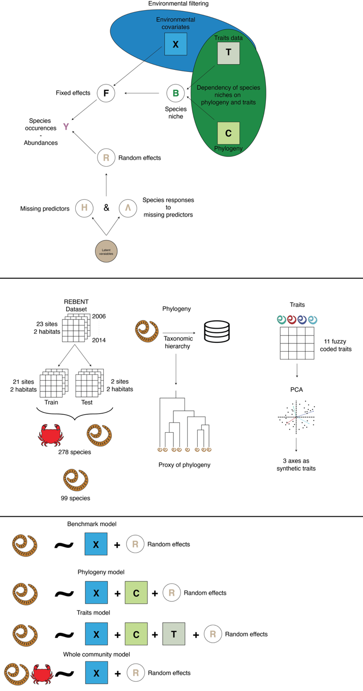{#fig:workflow}

![Comparison of the explanatory (left column) and predictive (right column) capacities of different model architectures fitted with occurrence (top line) or abundance (bottom line) data. [Mettre la légende en bas]](figures/explanatory-predictive-models.png){#fig:explanatory_predictions_power}

<!-- 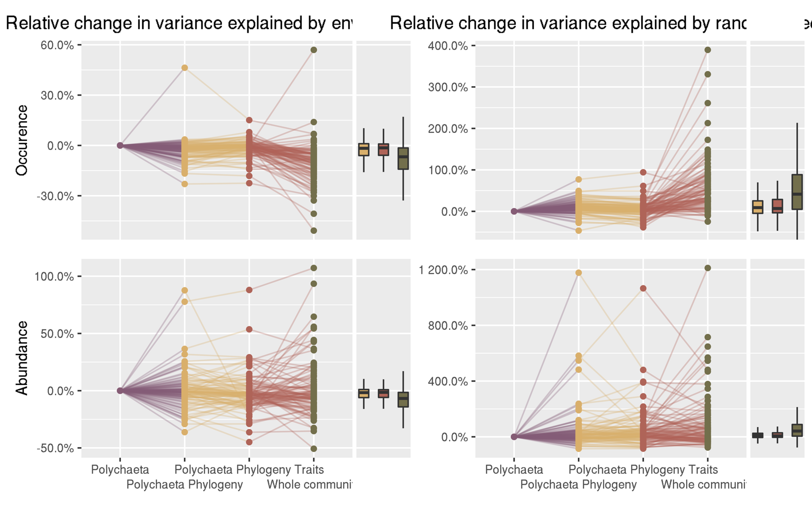{#fig:relative_change_varpart} -->

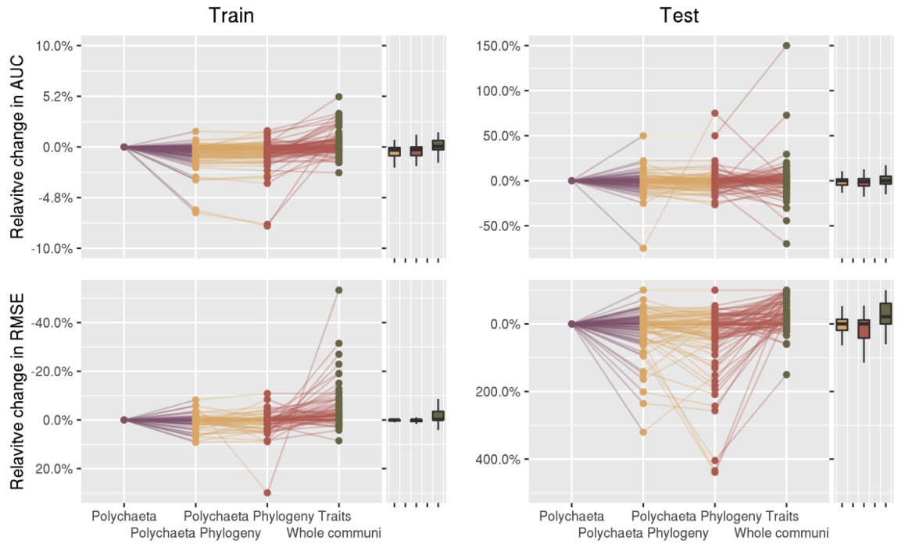{#fig:relative_change_explanation_prediction}

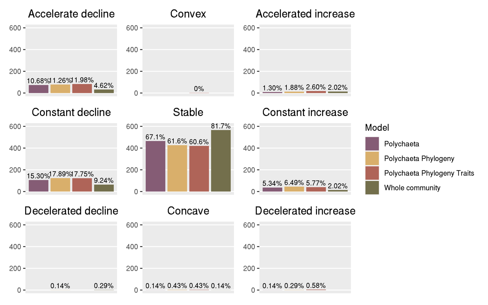{#fig:response_shape_ab}

## Supplementary

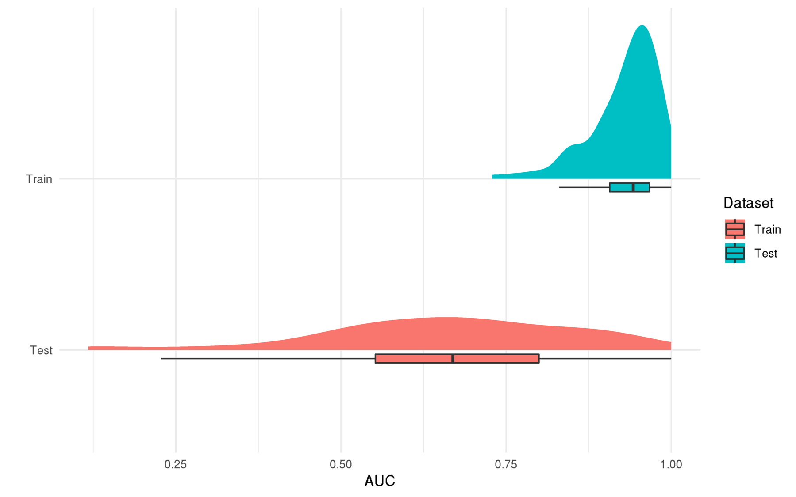{#fig:auc}

{#fig:pred_obs_train}

{#fig:pred_obs_test}

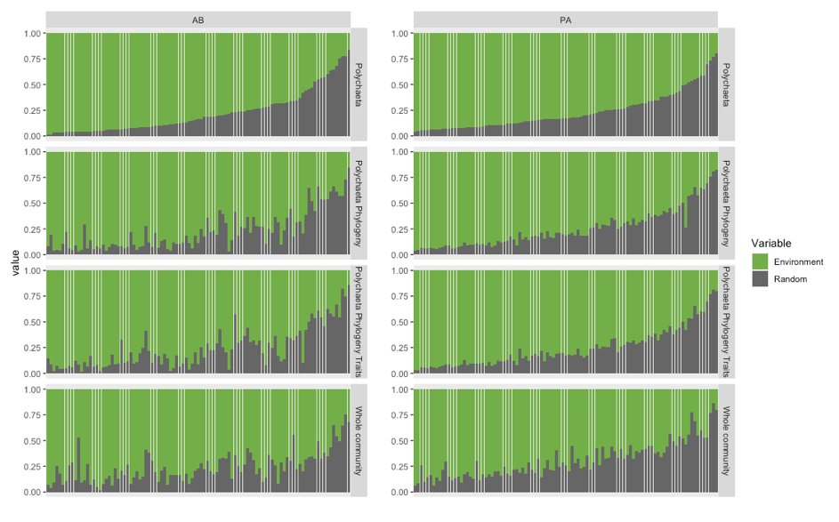{#fig:var_part}

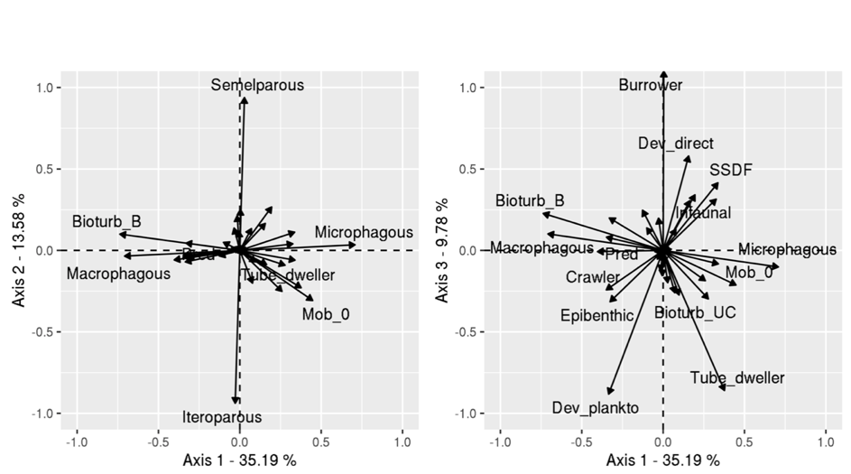{#fig:fuzzy_pca_traits}

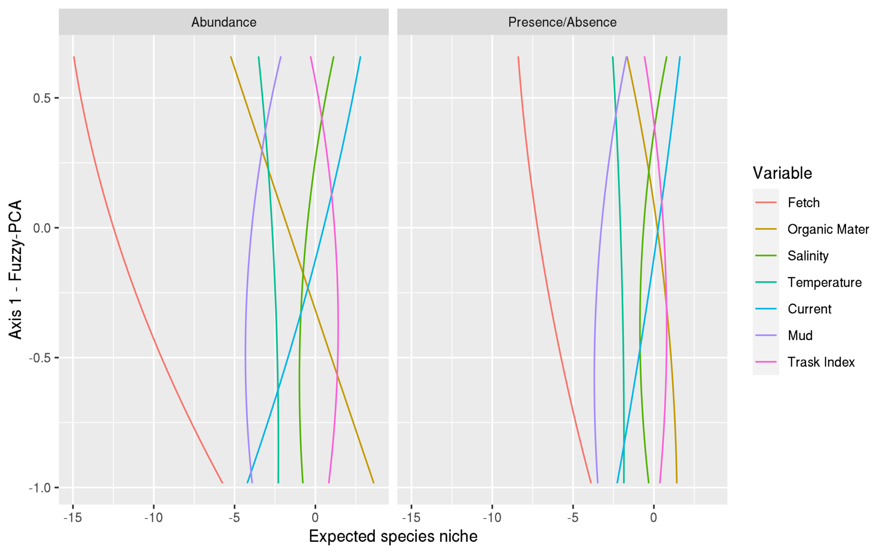{#fig:traits_effect}

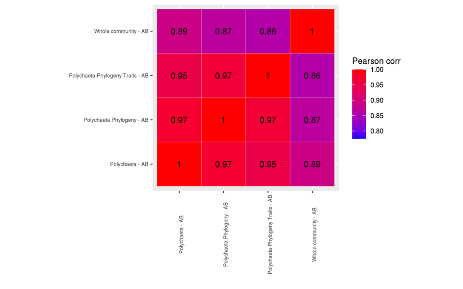{#fig:corr_env_ab}

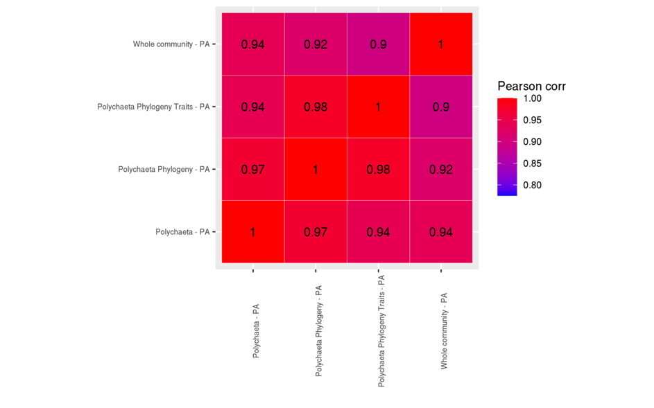{#fig:corr_env_pa}

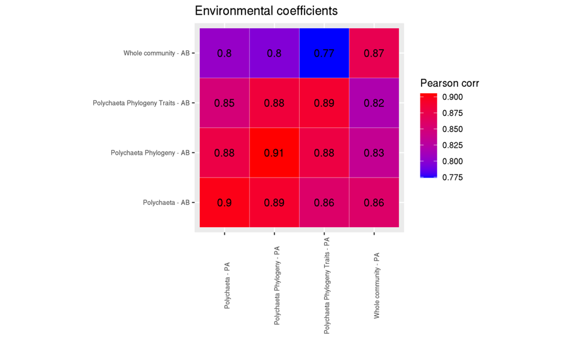{#fig:corr_env_ab_pa}

{#fig:residual_corr_abd}

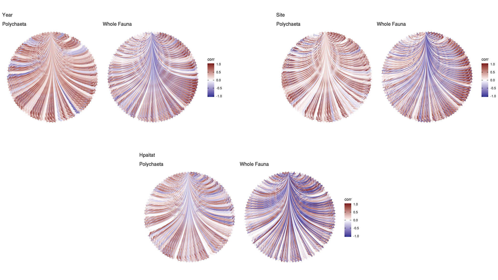{#fig:residual_corr_pa}

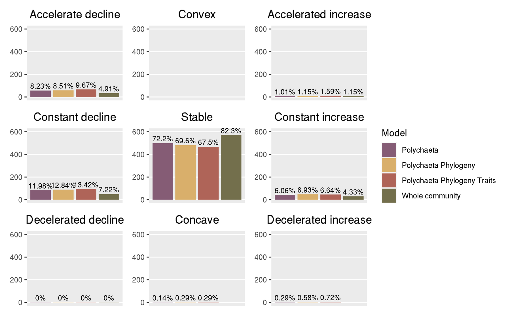{#fig:response_shape_pa}

# References

