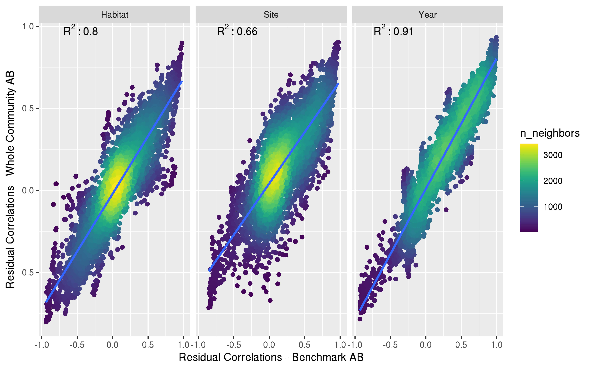
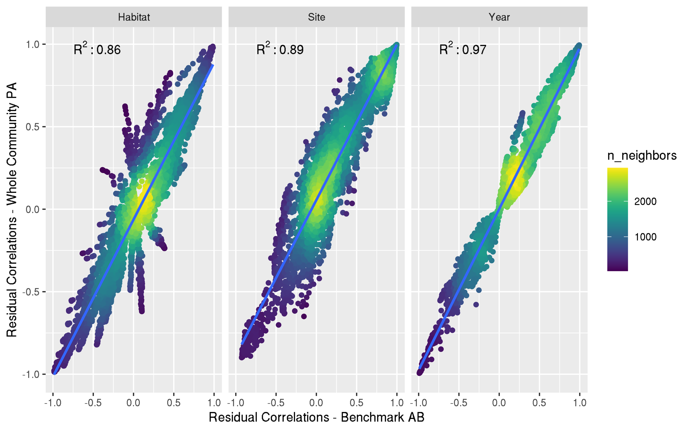
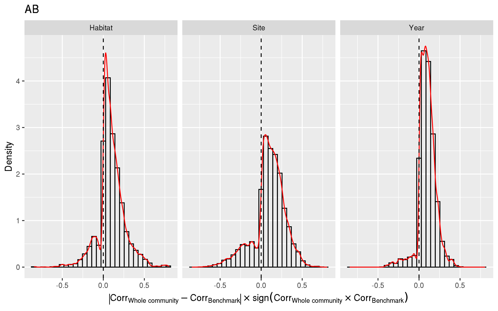
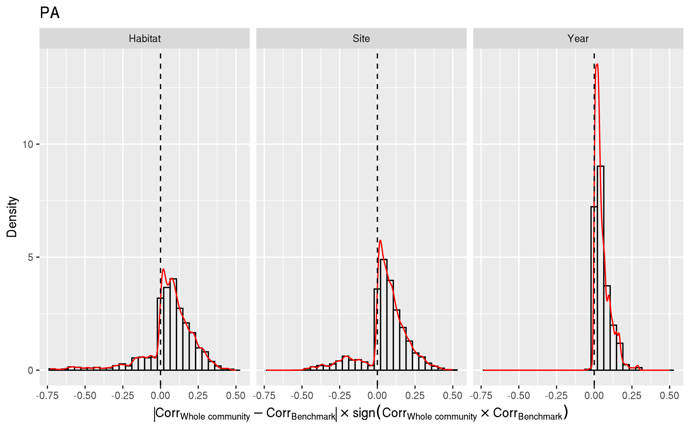

<!-- 

Liste des journaux possibles :

1. Methods in Ecology and Evolution. IF: 7.78. Research Article: Words 7000~8000

2. Ecology. IF: 5.499. Research Article or Statistical Reports. Words ~8000 (20 pages max)

3. Journal of Ecology. IF: 6.26. Resear articles. Words 8000

 -->

# Introduction

Community ecology aims at explaining and predicting the processes that drive species diversity and their variability in space and time. Understanding the processes that determine the distribution of species on the planet and the associated spatio-temporal dynamics is particularly important for mitigating the effects of global climate change and the sixth mass extinction [@ipbes_2019]. Thus, major current challenges for ecologists include describing, explaining, and predicting community change and different components of biodiversity [@Tredennick_2021] so as to inform  effective management or restoration measures in a rapidly changing world [@Brudvig_2022; @Dietze_2018; @Houlahan_2017]. Joint Species Distribution Models (jSDM) are particularly well-suited tools to address these challenges, whether to characterize processes that shape  observed community [@Ovaskainen_2017a], or to predict the future fate of community [@Norberg_2019].

jSDMs are multivariate extensions of  Species Distribution Models (SDMs), which have been broadly applied over the past decades across all terrestrial and aquatic realms to understand and predict species occurrences [@Elith_2006 ; @Norberg_2019] and abundances [@Howard_2014 ; @Waldock_2022] using environmental predictors. One advantage compared to machine-learning models more tailored toward predictions is the explain ability of jSDM and their explicit link with ecological theory [@Ovaskainen_2017a]. Moreover, relative to SDMs that only consider the abiotic niche of species (i.e. Grinellian niche, [@Elith_2009]), jSDMs, offers the advantages of capturing potential interactions between environmental and biotic processes [@Ovaskainen_2017a]. This promise of accounting for biotic interactions, attracted a lot of attention amongst researchers in ecology. Indeed, better understanding the role of biotic interactions remains a key question in community ecology [@Godsoe_2017] and it also offers a potential to improve multi-species model predictive power [@Giannini_2013; @Staniczenko_2017]. However, inference and interpretation of ecological networks using jSDMs remains challenging in practice for several reasons [@Blanchet_2020 ; @Holt_2020].

Firstly, jSDM have been mostly used to harness the vast number of species presence/absence data that is available [@Norberg_2019 ; @Wilkinson_2019 ; @Wilkinson_2020], but co-occurence networks inferred from these data does not provide direct access to species interactions [@Blanchet_2020 ; @Dormann_2018 ; @Sander_2017]. They only shed light into some aspects of species spatial and temporal associations [@Keil_2021]. In that respect, abundance data may provide a better proxy of the underlying interaction networks [@Blanchet_2020 ; @Momal_2020] and accordingly, jSDM have been increasingly extended to abundance data [@Chiquet_2021 ; @Hui_2016 ; @Ovaskainen_2017a ; @Popovic_2022]. Yet, abundance data come with their own modeling challenges, which have been only recently explored in the context of species distribution modeling [@Waldock_2022]. The predictive and explanatory power of jSDM on these types of data thus remains largely untested compared to presence/absence data [@Norberg_2019 ; @Wilkinson_2020]. 

Secondly, whether they are built using presence/absence or abundance data, several factors may limit or affect the interpretability and predictive ability of jSDM. In terms of interpretability, network inference in jSDM remains affected by unaccounted environmental variables and despite early claims, jSDMs do not allow to fully separate the environmental and biotic niche of the species [@Blanchet_2020 ; @Poggiato_2021]. For that purpose, one of the prerequisites for improving the predictions made by jSDMs is to take into account all the actors in the network [@Levine_2017]. Because many ecological studies only focus  on a subset of species community as only sampling certain taxonomic groups or clades [@Pollock_2014 ; @Hakkila_2018],  while neglecting non-target taxa, network inference by jSDMs is almost always skewed by missing ecological actors [@Momal_2021]. How this bias affects the predictive ability of jSDM remains untested. 

Finally, as directly derived from SDMs, jSDMs have easily been extended to take into account additional information sources about modeled species [@Niku_2019 ; @Ovaskainen_2017a]. Inclusion of additional species-specific  information for stacked SDM, such as phylogenetic relationships between species [@Ives_2011] or links between functional traits and the environment [@Pollock_2012] was shown to improve both explanatory and predictive powers of the SDMs[@Morales-Castilla_2017 ; @Vesk_2021]. Similar behavior is expected from jSDM [@Ovaskainen_2017a], but the relative influence of all the factors mentioned above on their interpretability and predictive power remain largely untested in available benchmarks of jSDM [@Norberg_2019 ; @Wilkinson_2019].

Applications and interpretation of jSDMs, which formulation can get fairly complex, can pose a number of challenges for ecologists. Thus, many practical questions remain concerning jSDMs application to ecological communities given in particular given the vast possibilities related to inclusion of additional species-specific information in the models. Specifically, what is the gain in explanatory and predictive power for a target species assemblage of (1) including phylogenetic and traits information, or (2) including abundance or occurrence data of non-target species? We hypothesize here that the inclusion of non-target species improves explanatory and predictive power compared to a baseline model, but this improvement is smaller compared to the inclusion of phylogenetic and functional trait information.

Here, we use the jSDM framework HMSC [@Tikhonov_2020] applied to a typical ecological dataset from the previous work of @Boye_2019a. This dataset provides the abundance of 519 species of benthic macrofauna, as well as traits for a subset of 234 species. Given our knowledge of the ecological and assemblage processes regulating these communities, we are able to systematically test  for the effects of including species-specific information and/or abundance or occurrence of non-target species on model explanatory and predictive powers. To do so, we created four alternative models: the first one including only the data of the targeted faunistic group and environmental data, the second one adding phylogenetic data to the previous model, the third one adding functional traits data to the second one and finally the last one including all the sampled species of the community without phylogeny nor traits. We also assess the influence of model complexity on their ecological interpretability and we choose to compare the different possible architectures of models to predict an assemblage of interest. 

# Material and Methods

We used the HMSC framework applied to the long-term REBENT coastal monitoring dataset ([rebent.ifremer.fr](https://rebent.ifremer.fr)). In the following subsections, we describe (1) the HMSC framework, (2) the data used in this study, (3) splitting of data into training and testing sets, (4) the suite of alternative models considered and their rationales, and (5) how models’ performances were assessed.

## Hierarchical Modeling of Species (HMSC)

"*HMSC* is a mutilvariate hierarchical generalized linear mixed model adjusted with Bayesian inference rooted in assembly theory" [@Ovaskainen_2020]. A *HMSC* model is composed of two parts: one taking into account fixed effects and the other taking into account random effects. The fix part models the realized niche (i.e., the set of environmental conditions that is biotically suitable and accessible) of each species (B matrix), where each dimension of the niche is a covariate included in the model [@Ovaskainen_2020]. Without any traits, the *HMSC* framework assumes that all species share the same expected niche value for each covariate, however, the width of each niche is assumed to be species-independent. Including trait data enables us to estimate species-specific expected niche value as well as trait-environment relationships, thus species with the same traits will tend to respond in a similar way to the environment [@Ovaskainen_2017a ; @Ovaskainen_2020]. In addition, it is now well established that closely related species tend to share similar trait values. This phylogenetic information can readily be included in the model. As a result, adding phylogenetic data to a *HMSC* model already including traits enables the model to capture residual information not included in the trait data, allowing for a better estimation of the species niches [@Ovaskainen_2020]. Due to the hierarchical nature of a *HMSC* model and the inclusion of phylogenetic information and/or traits data  fit [@Ovaskainen_2017a]. Furthermore, the inclusion of this additional information allows the fit of an HMSC model to be improved for rarer species, due to the hierarchical nature of this framework. Rare species can borrow information on traits and/or phylogeny/environment relationships from more common species that are phylogenetically close to them or that share the same traits [@Ovaskainen_2020].

Since *HMSC* can include a random part, it can constrain the estimated residuals with random effects. These random effects are estimated using latent variables: for each random effect, two matrices of latent variables are estimated [Ovaskainen_2017a ; @Tikhonov_2019b ; @Ovaskainen_2020] : (1) a first one is called *site loadings* ($H$ matrix) and contains the values of missing covariates not included in the model [@Ovaskainen_2017a ; @Ovaskainen_2020]; and, (2)the second matrix is hereafter referred to as *species loadings* ($\Lambda$ matrix) and corresponds to the response of the species to each of these missing predictors [@Ovaskainen_2017a ; @Ovaskainen_2020]. These missing covariates can typically represent  missing environmental features; or, in the ideal case where model predictors accurately characterize each species’ environmental niche, random effects  can theoretically capture biotic interaction signals [@Ovaskainen_2017a ; @Ovaskainen_2017b ; @Ovaskainen_2020].

Note that our choice to use *HMSC* rather than other available a jSDM frameworks (e.g. gllvm @Niku_2019 ; boral @Hui_2016 ; sjSDM @Pichler_2021) was motivated by its clear links  with ecological theory [@Ovaskainen_2017a]. Given existing comparative studies on jSDMs, we are confident that the results presented here, especially in terms of parameter estimation, should overall be robust across existing frameworks [@Norberg_2019 ; @Wilkinson_2019]. 

## Dataset

### Biotic dataset

Faunistic data were provided by the REBENT monitoring program. REBENT is a station-based monitoring network created following the dramatic oil spill induced by the sinking of the Erika tanker in december 1999 on Brittany’s coastline, in Western France. The goal of the monitoring network is to detect, characterize and explain changes in French benthic ecosystems through space and time. Here, we focused on two soft-bottom habitats, where the targeted polychaete species communities occur: intertidal bare sediments and intertidal seagrass (*Zostera marina*) beds sampled across 23 sites  along Brittany’s coastline. Each site was visited at least 6 times between 2006 and 2014 (mean = 9.35 ; SD = 3.41). In a nutshell, infauna species abundances were estimated using three sediment cores of 0.03m2  pooled together as a single sampling unit at each site. Each collected individual  was identified to the lowest taxonomic level, when possible, or to a higher taxonomical level, when in doubt. Details about sampling methodology are provided in @Boye_2017.

In order to independently assess models' predictive performance, the REBENT data was split into a training and a test set. The *training dataset* includes 180 observational units defined as unique combinations of years, site and habitat. Surveys conducted across  two specific sites, which included the two habitats and 35 observational units, were excluded from the *training set* and constituted an independent *test dataset*. The raw training and testing datasets were reduced from 519 to 278 species following the removal of rare species (which occurred less than 4 times across the 180 observational units in the *training set*).

Although we are interested in all the fauna collected by the REBENT program, trait data are only available for a particular class of organisms: polychaetes that are particularly studied in the region [@Boye_2019a]. Polychaeta traits data matrix was available for the 99 polychaeta species in the *training set* and includes 11 fuzzy-coded traits, which corresponds to a total of 41 modalities [@Boye_2019a]. Prior to jSDM fitting, the dimensionality of the trait matrix was reduced by applying the fuzzy-PCA *fpca* function from the *ade4* package [@Thioulouse_2018]. We kept the first three axes, which account for 59% of the total variance of the trait matrix, as synthetic traits data (+@fig:fuzzy_pca_traits). The first axis overall distinguishes between mobile predatory species and sessile microphage ones;  the second axis differentiates semelparous species from iteroparous one; and, the third axis separates burrower species from tube-dwelling ones. <!-- Finally, we compared the relationship between functional distance and taxonomic distance to estimate the congruence between these two sources of information.-->

Possessing traits for our 99 Polychaeta, we decided to retrieve their taxonomic classification via WoRMS database ([www.marinespecies.org](https://www.marinespecies.org)) to be included as a proxy for phylogenetic signal [@Ovaskainen_2020 ; @Ricotta_2012]. Phylogenetic distances between Polychaeta species were then estimated using the *ape* R package [@Paradis_2019].

### Environmental dataset

Based on @Boye_2019b, we selected 7 environmental variables to characterise the realized niche of each species within the sampled communities. These 7 variables quantify different components of coastal environmental variability, namely (1) fetch, which is a proxy for local wave exposure; hydrological properties such as (2) sea water temperature, (3)salinity and current velocity; and sedimentological properties such as (5) mud and (6) organic matter content, as well as (7) granulometric properties (Trask index). To capture the potential bell-shaped nature of ecological niches around an environmental optimal, orthogonal polynomials of degree 1 and degree 2 computed for each of these 7 variables were used as explanatory covariates in the models presented below.

## Comparison of alternative model structures

We fitted four alternative models of increasing complexity with the R-package *Hmsc*  [@Tikhonov_2020] and its default priors.

1. The first model, hereafter referred to as the *benchmark* model (*Bench*), uses only Polychaeta community data and the environmental covariates
2. The second one, hereafter referred to as the *phylogenetic* model (*Ph*), adds to the previous model phylogenetic data. Rare species can benefit from the phylogeny/environment relationship learned by commune closely related species.
3. The third one, hereafter referred to as the *traits and phylogeny* model (*TrPh*), adds to the previous traits data. Rare species can also benefit from the traits/environment relationship learned by commune species sharing the same functional traits. Moreover, the inclusion of the phylogeny can capture signals missed by the traits.
4.   The fourth and last model, hereafter referred to as the *whole community* model (*WhC*), uses the whole 278-species community data and the environmental covariates, but did not include trait nor phylogenetic data for sake of computation time.

All these four models were fitted twice, using occurrence and abundance data. Moreover, all these models and their occurrence/abundance variants shared the same random effect: one temporal random effect related to sampling years, one spatial random effect related to sampling sites and the last one related to habitat (bare *vs* seagrass).

## Fitted models & Analysis

### Model fitting using Markov Chain Monte Carlo 

We sampled the posterior distributions of each model using similar setups: we ran 15 Markov Chain Monte Carlo chains over 30,000 iterations each. The first 10,000 iterations were discarded as burn-in and the remaining were thinned by 20 to yield 1,000 posterior samples per chain. Hence, in total, we sampled 15,000 posterior samples per parameter. We then examined MCMC convergence for each model parameter using the potential scale reduction factors [@Gelman_1992]. The MCMC convergence and the effective sample size of the different HMSC models were satisfactory (see supporting information XXX).

### Assessing model performance and interpretability

To investigate different aspects of jSDM predictions, models were evaluated through a set of complementary metrics [@Wilkinson_2020]. Goodness of fit and predictive power of all models were assessed using AUC for occurrence data. Additionally, the root mean squared errors (RMSE) was computed for abundance-based models. We investigated whether there was a model who improved its performance relative to benchmark via the Dunn's multiple comparison test [@Dunn_1964]. Then, for the model that demonstrated the best improvement, we examined whether the improvement correlated with individual species  occurrence or abundance (e.g., higher improvement expected for abundant species than for rare ones).

To assess model interpretability, we calculated the proportion of explained variance attributed to either the environmental covariates or to the random effects. We also classified the shapes of the quadratic species-environmental relationship inferred from the different models according to their direction (decline, null or increase) and their acceleration (decelerated, constant or accelerated) [@Rigal_2020]. We also explored qualitatively the differences between observed and predicted community composition  by decomposing the total beta diversity (using the Sørensen index. On the abundance dataset, the data have been transformed to presence/absence) into species turnover and replacement using @Baselga_2010 framework and the *betapart.temp()* function  from the *betapart* package @Baselga_2022.  A model predicting the exact observed community would have a total beta diversity of 0, in contrast, a model predicting a community completely different from the one observed would then have a total beta diversity of 1. As outlined above the Baselga's framework allow to decompose in two components the type of error when predicting community composition: (1) getting the identity of the species wrong (turnover) or (2) predicting the right species and omitting some (nestedness). In the first case, the model will correctly predict specific richness, but in the other case the model will be more conservative in predicting the correct species.   

Finally, we qualitatively studied the information captured by the latent variables by examining residual correlations between species. We were also interested in the agreement of the estimated correlation coefficients between the *Bench* model and the best performing model. We also used an index to estimate the magnitude and the eventual sign change of the correlation coefficients estimated by these two models. This index is calculated as follows:

$$\text{Index} = |corr_{\text{best model}} - corr_{\text{benchmark}}| * sign(corr_{\text{best model}} * corr_{\text{benchmark}})$$

# Results

## Model Fit & Predictive power

### Species level

Models fitted with occurrence data presented an excellent explanatory power (i.e., in-sample predictions), with the AUC computed on the *training set* being on average greater than 0.9 (+@fig:explanatory_predictions_power). In contrast, the predictive power of the models (i.e., out-of-sample predictions) were significantly lower with the AUC computed on the *test set* being about 0.65 on average (+@fig:explanatory_predictions_power). For abundance-based models, the RMSE computed on the *training set* ranged from 8.92 to 9.34 on average. Predictive power of the different abundance-based models was quite heterogeneous with the *whole community* (*WhC*) model (associated with an RMSE of 5.83) performing better than the three other models (associated with much larger RMSE values ranging from 54.2 to 95.6, on average).

For the sake of interpretability, all models were compared against the corresponding (i.e., occurrence-based versus abundance-based) benchmark model (*Bench*) (+@fig:relative_change_explanation_prediction). According to the Dunn multiple comparison test, explanatory power was not significantly improved in the *trait and phylogeny* (*TrPh*) nor *phylogeny* (*Ph*) models but only slightly increased for the *WhC* models relative to the corresponding *Bench* models (occurrence- or abundance-based) (+@fig:explanatory_predictions_power).  Actual increase in explanatory power remains  however modest : the AUC increases in average by 0.0034 ± 0.0114 (mean ± sd) for the models fitted with occurrence data and the RMSE decreases by 0.035 ± 0.796 (mean ± sd) for the models fitted with abundance data. In terms of predictive power, performance was only significantly increased for the abundance-based whole community model with a decrease in RMSE of 0.27 ± 0.44 (mean ± sd) relative to the benchmark. Improvement in the explanatory power of the *Whc* model mainly concerned the most common and abundant species, as reflected by the negative correlations between species-specific RMSE and mean species occurrence (Kendall’s τ = -0.28, p-value < 1e-5) or mean species abundance (Kendall’s τ = -0.29, p-value < 1e-4), respectively.

### Community level

On the training set, the median Sørensen dissimilarity is 0.37 (ranging from 0.36 to 0.38) across all models fitted (both occurrence- and abundance-based), which suggests that modelled community composition are relatively similar to the observed community (+@fig:beta_part_ab and @fig:beta_part_pa). The error that the models make is equally distributed between turnover and nestedness. With the test data set, we obtained a median Sørensen dissimilarity of about 0.65 for the models fitted with abundance data and about 0.72 for the models fitted with occurrence data. With the *test set*, we obtained a median Sørensen dissimilarity of about 0.65 for the models fitted with abundance data and about 0.72 for the models fitted with occurrence data (+@fig:beta_part_ab and @fig:beta_part_pa). The increase in model community composition errors is a direct consequence of the degradation of the predictive capabilities of the various models at species-specific scale. Nevertheless, it should be noted that the *Whc* model makes more nestedness errors than the others, despite its limited performance, it is more conservative in terms of the composition of the predicted community (+@fig:beta_part_ab and @fig:beta_part_pa).

## Variance partionning

The amount of variance explained by each model can be decomposed between environmental covariates and random effects. For all models, the environmental variables account for most (> 75 % ± 18, on average) of the explained variance (+@fig:var_part in supplementary material XXXX). However, when looking at the relative change in the share of variance explained by the models, we find that a larger part of variance is explained by random effects in the whole community  model than in other models (+@fig:var_part). For abundance-based models, the median of the relative change in variance explained by the random effects relative to the *Bench* is +0.086 for the *Ph* model, +0.199 for the *TrPh* model and +0.354 for the *WhC* model (+@fig:relative_change_varpart). A similar increase in variance explained by random effects for the whole community model relative to the benchmark is observed when fitted with occurrence data (+@fig:relative_change_varpart).

## Species niche estimated

Species niches are better estimated with abundance data [@Ashcroft_2017], so that only abundance based result will be presented for this part (the results for occurrence-based model are presented in supplementary material XXXX). For the models fitted with abundance data, almost none of the response curves have a convex or a concave shape. For the benchmark, phylogenetic and trait models, more than 60% of the estimated curves are flat, which suggests a lack of ecologically meaningful species-environment relationships. This rate reaches more than 80% for the whole community model. Besides flat responses, the other species-environment relationships were classified as constant or accelerated declines. For the models that do not include the whole community, ~10% and ~15% of species-environment curves were classified as accelerated decline  and constant decline, respectively. For the whole community model, these percentages dropped to 4.62% and 9.24%, respectively.

Considering the trait model, we further investigated the link between the first fuzzy-PCA axis obtained from the trait matrix and the seven environmental predictors to determine whether some traits were favoured (or hindered) under certain environmental conditions (+@fig:traits_effect in supplementary materials). Both abundance and occurrence-based models highlighted some potentially meaningful  trait-environment relationships. For instance, we found that mobile predatory species were more negatively affected by fetch than sessile suspensivore. In addition, both increasing concentration in organic matter and decreasing current velocities are estimated to favour  suspensivore populations.

## Exploring the residual correlation

Since all models included the same random effects, we qualitatively compared the residual correlations estimated by the *Bench* model and by the *WhC* model both for occurrence- and abundance-based. We specifically considered the latter for this specific comparison, given (1) its higher performances relative to other alternative models and (2) the larger proportion of variance explained by random effects in this model relative to all others (+@fig:residual_corr_abd and +@fig:residual_corr_pa supporting information).

Qualitatively, the residual correlations estimated by the *WhC* model and those estimated by the *Bench* model are quite similar, whether the models are fitted with presence/absence or abundance data (+@fig:res_corr_raw_ab & @fig:res_corr_raw_pa). However, it should be noted that when comparing the models fitted with abundance data (+@fig:res_corr_raw_ab) with the random effect *site*, the estimated correlations are the most variable between the two models ($\text{R}^2 = 0.66$). For the models fitted with presence/absence, the two models show fairly similar correlations ($R^2$ between 0.86 and 0.97), regardless of the random effect considered (+@fig:res_corr_raw_pa). Moreover, the random effect *year* is the one that presents the most agreement between the models, whether they are fitted with abundance or occurrence data ($\text{R}^2$ of 0.91 and 0.97 respectively).

Our index also qualitatively identifies the correlation coefficients that have changed the most between the *Bench* and *WhC* models. For the models fitted with abundance or occurrence data (+@fig:res_corr_index_ab and @fig:res_corr_index_pa), it is possible to notice that the mode of our index is close to zero, confirming the agreement between the residual correlations described by +@fig:res_corr_raw_ab and @fig:res_corr_raw_pa above. Our index also allows us to identify a second negative mode this time present on all the random effects of the models fitted with abundance data and present only on the random effects *Habitat* and *Site* for the models fitted with occurrence data. For the models fitted with abundance data, the random effects *Habitat*, *Site* and *Year* have respectively 13.3, 17.7 and 6.00% of the correlation coefficients that changed sign between those estimated by the *Bench* model and those estimated by the *WhC* model. For the occurrence data, the results are similar since the random effects *Habitat* and *Site* have respectively 16.5 and 14.5% of their coefficients that have changed sign, for the random effect *Year*, it is only 0.3% of the coefficients that have changed sign between the two models.

# Discussion

## Including non-focal species enhances predictive power

Including non-focal species in our species dataset improves the predictive power of our model with respect to our target species assemblage, whereas including phylogeny or traits does not. A first hypothesis that could explain this phenomenon would be that the model with the whole community would include biotic interactions. However, it is now established in the literature that the potential biotic signal captured by the latent variables is confounded by many confounding factors such as too low spatial resolution [@Konig_2021; @Zurell_2018] , or environmental variables not included in the model [@Blanchet_2020; @Dormann_2018; @Zurell_2018]. The absence of some environmental variables does not allow the models to estimate the entire realized niche, but the inclusion of many other species also subject to these same environmental filters enables the whole species model to include this missing information through the other species subject to the same environmental conditions [@Poggiato_2021].

Contrary to our original assumptions, in our case study, the inclusion of additional data did not improve the predictive power of our models compared to the benchmark. The lack of improvement in predictive power following the inclusion of phylogenetic data can be attributed to the use of taxonomic data as a proxy for phylogeny. At best, taxonomy approximates phylogeny and does not reflect the evolutionary history of species [@Hao_2019; @Niamir_2016]. Moreover, polychaetes are known to be diverse in their lifestyle [@Boye_2019a]. Thus, two taxonomically close species may occupy relatively different niches, rendering invalid the assumption made by this approach. 

It is recognized that the use of response traits can highlight certain responses of organisms such as plants [@Bjorkman_2018] or fishes [@Mouillot_2007] to environmental gradients, the inclusion of traits has resulted in a slight decrease in predictive power in our case study. Although our traits are derived from an expert consensus, it is not certain that the traits identified are response traits in the sense of @Violle_2007 and that the traits included in the model do not modify the realized niche of each species. It could also be that the traits used in this case study are not at fault and that the decrease in performance comes from the hierarchical structure of the HMSC model. Our trait-inclusive model also includes phylogeny: these two sources of information will interact to estimate the variance of estimated niches for each species [@Ovaskainen_2020]. Thus, if either of these data sources is uninformative, it may lead to a decline in model performance.

## Interpretability of a *jSDM* applied to a large number of species

The explanatory power of all our models is good overall - the mean AUC calculated on all polychaete species for the presence/absence models is greater than 0.9 for all species and the mean RMSE on abundances remains decent, around 9. Thus, species community variability is well explained by all our models, but their interpretability remains a challenge. Here, we successfully examined the regression coefficients of 99 species by applying the @Rigal_2020 framework to the posterior distribution of each environmental coefficient. By partitioning the explained variance, we identified that the model with the whole community relied more on latent variables. The latter allow greater flexibility in the model and thus a better fit to the data, but at the cost of more difficult interpretability.  Thus, it is difficult to understand why explanatory and predictive abilities improve for some species and degrade for others when phylogeny, traits or the whole community is included. 

The use of latent variables therefore adds a layer of complexity, which can transform "transparent" multivariate statistical models into "black boxes". However, the use of such models, hard to interpret makes it harder to accept their predictions [@Ryo_2021], verify their underlying assumptions and to debug them [@Molnar_2022]. Although the use of methods to interpret complex non-statistical models is growing in ecology [@Lucas_2020; @Ryo_2021], it is necessary to develop tools adapted to understand the ecological processes captured by jSDMs.

A first approach to study latent variables would be to analyse the residual correlations between species estimated with these latent variables. This approach is quite challenging, since it implies examining $\frac{ntimes \left(n-1\right)}{2}$ pairs of residual correlations per random effect included in the model, i.e. in our case 14,553 coefficients. The use of network metrics could solve this problem, but although the reconstruction of interaction networks is in principle possible through the latent variables of jSDM [@Momal_2020], the question of the random effect to be considered would still arise. Moreover, the use of metrics remains limited in this specific case, as co-occurrence is not a sufficient condition for interaction between species [@Blanchet_2020].

## A difficult species-rich case study that reveals potential pitfalls of jSDM on noisy ecological datasets

Sampling methods are particularly important in ecology and have a strong impact on species distribution models [REF]. These methods all generate a number of biases and our data are no exception. The organisms we sample are relatively small and may or may not form dense aggregations of several hundred thousand individuals per square meter [@Bolam_2002], so the sampling method used here to construct the faunal dataset may induce zero inflation, as well as overdispersion. The problem of zero inflation is relatively easy to solve, since the presence/absence models developed in this study allow to set up abundance models conditioned on presence (i.e. hurdle models) [@Ovaskainen_2020]. Overdispersion poses a bigger problem, since it is difficult to model this kind of data with simple statistical distributions.

The scale of environmental data acquisition may also explain some of the difficulties of models in explaining and predicting the occurrence or abundance of certain species. Indeed, the REBENT program is interested in benthic macrofauna, i.e. organisms of a few centimeters, while the environmental data are acquired with a resolution of XX. Thus, our models do not take into account the microclimates experienced by the species studied here [@Potter_2013]. In addition, there can be a high variability between the values of environmental predictors measured on the foreshore by *in situ* recorders [@Lathlean_2011] and satellite data at a coarser resolution. Using environmental data at the site scale would then increase the explanatory power of the models [@Lembrechts_2019] and probably their predictive capabilities.

# Conclusion

Our case study illustrates the importance of including all species in a community to improve the predictive power of a jSDM model on a particular species assemblage. Therefore, it is not necessary to acquire expensive species-specific data such as phylogenetic distances or functional traits. However, the use of these data sources is not without interest since they facilitate the understanding of the ecological processes highlighted by the model.

# Figures

## Main

{#fig:workflow}

![Comparison of the explanatory (left column) and predictive (right column) capacities of different model architectures fitted with occurrence (top line) or abundance (bottom line) data. [Mettre la légende en bas]](figures/explanatory-predictive-models.png){#fig:explanatory_predictions_power}

{#fig:relative_change_explanation_prediction}

{#fig:beta_part_ab}

{#fig:beta_part_pa}

{#fig:var_part}

{#fig:relative_change_varpart}

{#fig:response_shape_ab}

{#fig:res_corr_raw_ab}

{#fig:res_corr_raw_pa}

{#fig:res_corr_index_ab}

{#fig:res_corr_index_pa}

## Supplementary

{#fig:auc}

{#fig:pred_obs_train}

{#fig:pred_obs_test}

{#fig:fuzzy_pca_traits}

{#fig:traits_effect}

{#fig:corr_env_ab}

{#fig:corr_env_pa}

{#fig:corr_env_ab_pa}

{#fig:residual_corr_abd}

{#fig:residual_corr_pa}

{#fig:response_shape_pa}

# References

